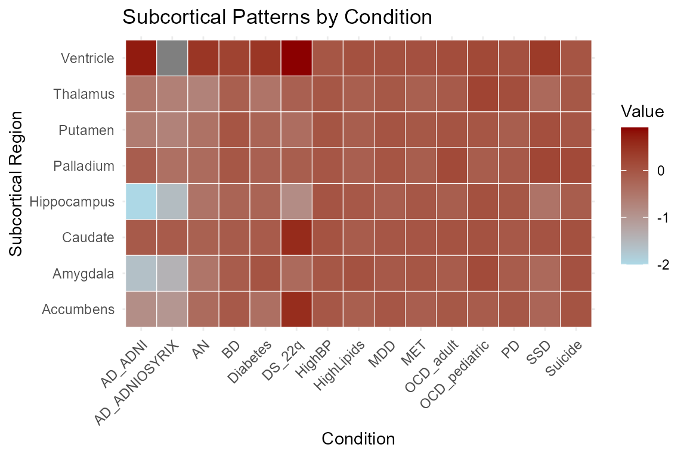
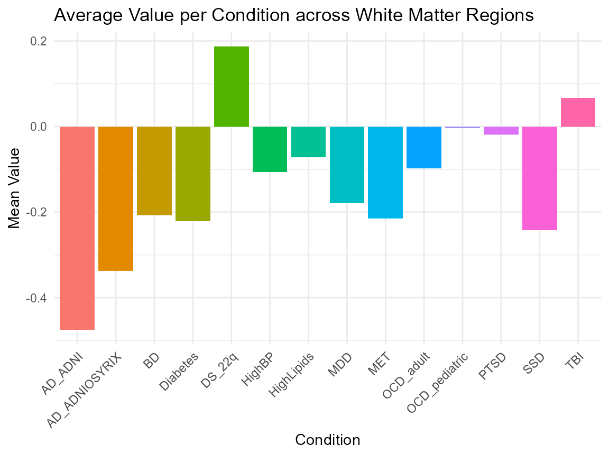
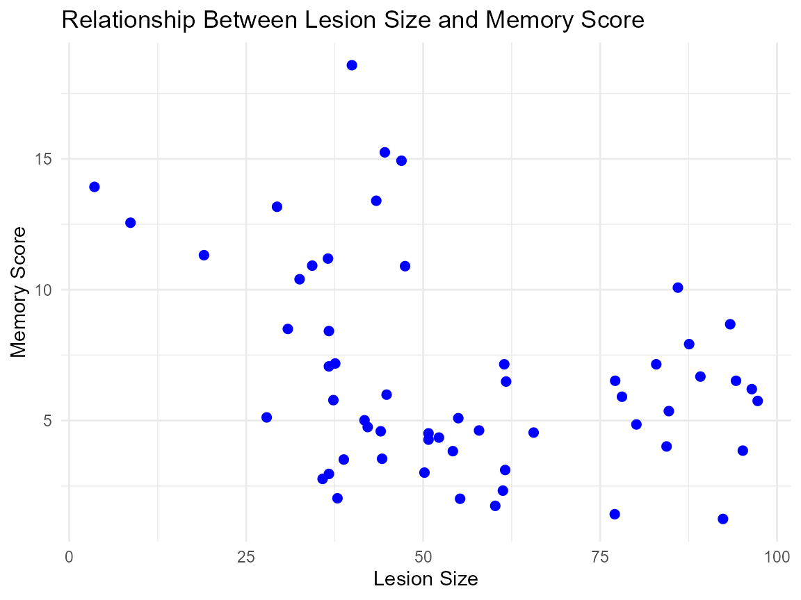

# NeuroDataSets: A Comprehensive Collection of Neuroscience and Brain-Related Datasets

``` r

library(NeuroDataSets)
library(dplyr)
#> 
#> Attaching package: 'dplyr'
#> The following objects are masked from 'package:stats':
#> 
#>     filter, lag
#> The following objects are masked from 'package:base':
#> 
#>     intersect, setdiff, setequal, union
library(ggplot2)
```

## Introduction

The `NeuroDataSets` package offers a rich and diverse collection of
datasets focused on the brain, the nervous system, and neurological and
psychiatric disorders. It includes comprehensive data on conditions such
as **Parkinson’s disease, Alzheimer’s disease, dementia, epilepsy,
schizophrenia, autism spectrum disorder, attention deficit hyperactivity
disorder (ADHD), Tourette’s syndrome, traumatic brain injury, gliomas,
migraines, headaches, sleep disorders, concussions, encephalitis,
subarachnoid hemorrhage, and mental health conditions**.

The package contains a wide variety of data types, including clinical,
experimental, neuroimaging, behavioral, cognitive, and simulated
datasets. These datasets encompass **structural and functional brain
data, cross-sectional and longitudinal MRI imaging studies,
neurotransmission metrics, gene expression profiles, cognitive
performance assessments, intelligence metrics, sleep deprivation
effects, treatment outcomes, brain-body relationships across species,
neurological injury patterns, and acupuncture interventions**.

**Designed for researchers, neuroscientists, clinicians, psychologists,
data scientists, and students**, this package facilitates exploratory
data analysis, statistical modeling, machine learning applications, and
hypothesis testing in neuroscience and neuroepidemiology.

### All datasets within NeuroDataSets

``` r


view_datasets_NeuroDataSets()
#>  [1] "ADHD_df"                     "AD_biomarkers_tbl_df"       
#>  [3] "ASD_risks_tbl_df"            "DA_schizophrenia_tbl_df"    
#>  [5] "OASIS_cross_tbl_df"          "OASIS_long_tbl_df"          
#>  [7] "SAHemorrhage_df"             "TBI_age_tbl_df"             
#>  [9] "TBI_military_tbl_df"         "TBI_steroids_df"            
#> [11] "WMpatterns_tbl_df"           "aba_phenotype_data_df"      
#> [13] "ability_intelligence_list"   "acupuncture_df"             
#> [15] "adolescent_mental_health_df" "alzheimer_smoking_df"       
#> [17] "bilingual_brains_df"         "blood_brain_barrier_df"     
#> [19] "brain_litter_mammals_df"     "brain_size_iq_df"           
#> [21] "brain_string_players_df"     "brainexpression_df"         
#> [23] "brains_cognitive_matrix"     "brainvolume_df"             
#> [25] "cerebellar_age_df"           "chimpbrains_df"             
#> [27] "cocaine_dopamine_df"         "dementia_df"                
#> [29] "encephalitis_df"             "epilepsy_RCT_tbl_df"        
#> [31] "epilepsy_drug_qol_df"        "epilepsy_drug_trial_df"     
#> [33] "gm_expected_patterns_tbl_df" "guineapig_neuro_df"         
#> [35] "hippocampus_lesions_df"      "iq_country_tbl_df"          
#> [37] "mammals_brain_body_df"       "markers_brain_df"           
#> [39] "markers_human_brain_df"      "markers_mouse_brain_df"     
#> [41] "migraine_treatment_df"       "migraines_df"               
#> [43] "migrane_dose_df"             "neanderthal_brains_df"      
#> [45] "neuro_pointprocess_matrix"   "neurodeg_dose_df"           
#> [47] "nfl_concussions_tbl_df"      "parkinsons_dopamine_list"   
#> [49] "pediatric_glioma_tbl_df"     "psych_neurocog_df"          
#> [51] "sleep_deprivation_tbl_df"    "sleep_disorder_df"          
#> [53] "sleep_performance_df"        "subcortical_patterns_tbl_df"
#> [55] "tourette_ADHD_df"
```

### Dataset Suffixes

Each dataset in the `NeuroDataSets` package uses a `suffix` to denote
the type of R object:

- `_df`: A data frame

- `_list`: A list

- `_tbl_df`: A tibble

- `_matrix`: A matrix

### Example Datasets

Below are selected example datasets included in the `NeuroDataSets`
package:

- `subcortical_patterns_tbl_df`: Patterns of Subcortical Structures.

- `WMpatterns_tbl_df`: Expected Patterns of White Matter.

- `hippocampus_lesions_df`: Memory and the Hippocampus.

### Data Visualization with NeuroDataSets Data

#### Patterns of Subcortical Structures

``` r


# Convert the dataset to long format using only base R + dplyr

long_data <- subcortical_patterns_tbl_df %>%
  select(Subcortical, everything()) %>%
  as.data.frame() %>%
  reshape(
    varying = names(.)[-1],
    v.names = "Value",
    timevar = "Condition",
    times = names(.)[-1],
    direction = "long"
  ) %>%
  select(Subcortical, Condition, Value)

# Create a heatmap
ggplot(long_data, aes(x = Condition, y = Subcortical, fill = Value)) +
  geom_tile(color = "white") +
  scale_fill_gradient(low = "lightblue", high = "darkred") +
  labs(
    title = "Subcortical Patterns by Condition",
    x = "Condition",
    y = "Subcortical Region",
    fill = "Value"
  ) +
  theme_minimal() +
  theme(axis.text.x = element_text(angle = 45, hjust = 1))
```



#### Expected Patterns of White Matter

``` r


# Compute mean values using updated anonymous function syntax
summary_data <- WMpatterns_tbl_df %>%
  select(-WM) %>%
  summarise(across(everything(), \(x) mean(x, na.rm = TRUE))) %>%
  as.data.frame()

# Reshape from wide to long format using base R
summary_data <- data.frame(
  Condition = names(summary_data),
  MeanValue = as.numeric(summary_data[1, ])
)

# Plot
ggplot(summary_data, aes(x = Condition, y = MeanValue, fill = Condition)) +
  geom_bar(stat = "identity") +
  labs(
    title = "Average Value per Condition across White Matter Regions",
    x = "Condition",
    y = "Mean Value"
  ) +
  theme_minimal() +
  theme(axis.text.x = element_text(angle = 45, hjust = 1)) +
  guides(fill = "none")  # Optional
```



#### Memory and the Hippocampus

``` r


# Lesion Size and Memory Score

ggplot(hippocampus_lesions_df, aes(x = lesion, y = memory)) +
  geom_point(color = "blue", size = 2) +
  labs(
    title = "Relationship Between Lesion Size and Memory Score",
    x = "Lesion Size",
    y = "Memory Score"
  ) +
  theme_minimal()
```



### Conclusion

The `NeuroDataSets` package offers a comprehensive and curated
collection of datasets spanning a wide spectrum of neurological,
psychiatric, and cognitive conditions. By integrating data from clinical
trials, peer-reviewed research, military health records, sports injury
databases, and international comparative studies, this package provides
researchers with robust resources for cutting-edge neuroscience
research.

Whether you are conducting exploratory data analysis, building
predictive models, testing statistical hypotheses, or teaching
neuroepidemiology and data science, `NeuroDataSets` delivers
well-structured, documented, and diverse datasets that reflect the
complexity of brain function, neurological disorders, and their
treatments.

For detailed information and full documentation of each dataset,
including variable descriptions, data sources, and usage examples,
please refer to the reference manual and help files included within the
package.
