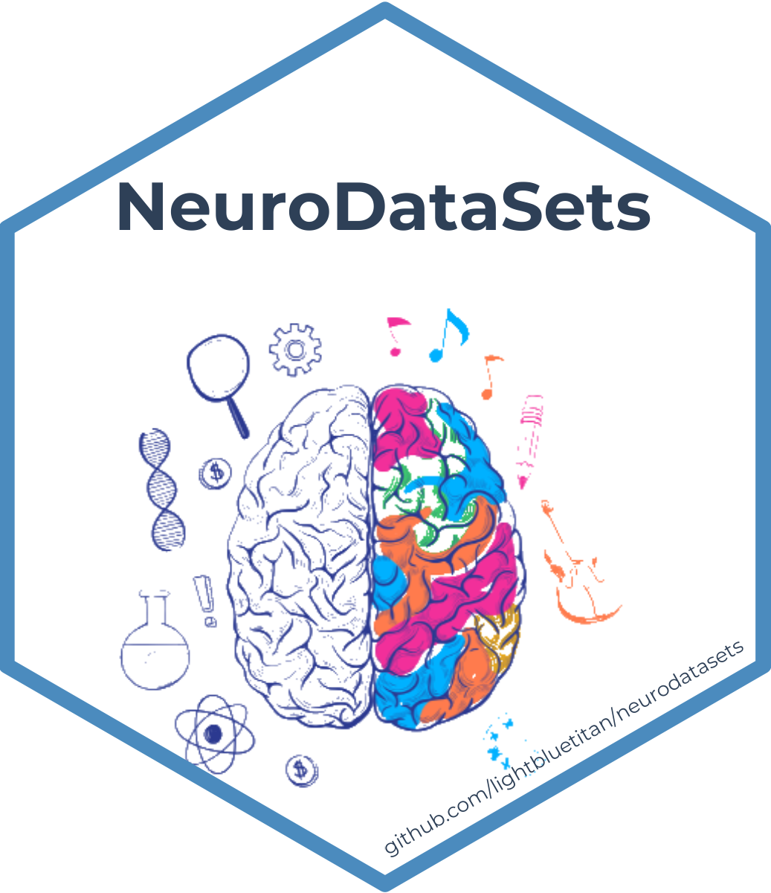

# NeuroDataSets: A Comprehensive Collection of Neuroscience and Brain-Related Datasets

This package provides a diverse collection of datasets focused on the
brain, nervous system, and related disorders. The package includes
clinical, experimental, neuroimaging, behavioral, and cognitive data on
conditions including Parkinson's, Alzheimer's, epilepsy, schizophrenia,
autism, ADHD, Tourette's, TBI, brain tumors, migraines, sleep disorders,
and mental health.

## Details

NeuroDataSets: A Comprehensive Collection of Neuroscience and
Brain-Related Datasets

A Comprehensive Collection of Neuroscience and Brain-Related Datasets.

## See also

Useful links:

- <https://github.com/lightbluetitan/neurodatasets>

## Author

**Maintainer**: Renzo Caceres Rossi <arenzocaceresrossi@gmail.com>
